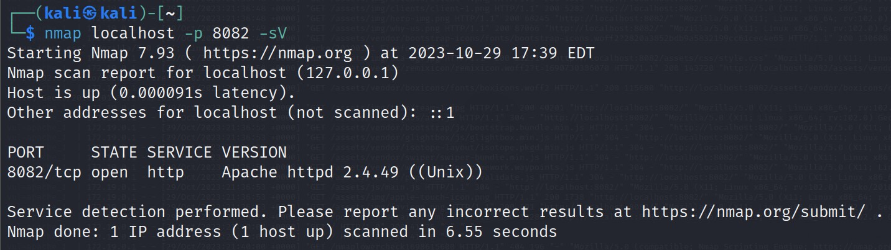
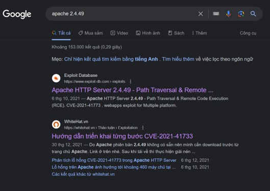
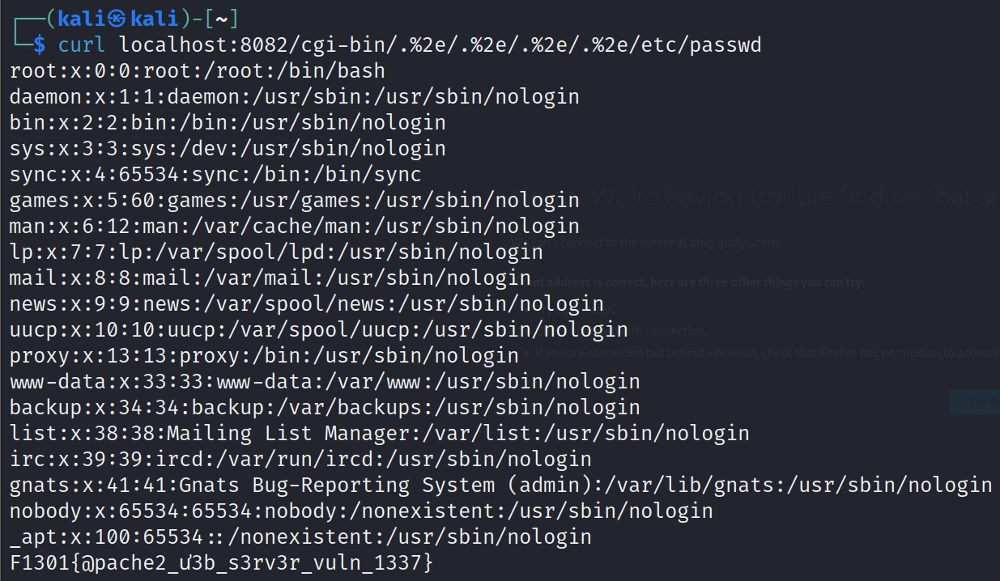

# web-server-attack-seminar writeup

## Apache Server
*Target:* 
- Đọc được nội dung file /etc/passwd

*Process:*
- Đề bài cho chúng ta một trang web giới thiệu về một công ty nào đó, web có các chức năng giới thiệu về công ty. 

- Trong quá trình recon, team đã sử dụng công cụ nmap để tìm hiểu về dịch vụ đang chạy trên web server này.  Sử dụng cờ `-sV` và ta có kết quả scan như sau:

- Osint trên google về các lỗi bảo mật của phiên bản **Apache 2.4.49** ta tìm được *CVE-2021-41773* về lỗi Path Traversal:

- Lỗi này xảy ra khi phiên bản này không kiểm tra được đầy đủ các kĩ thuật encoding url truyền vào. Cụ thể ở đây phiên bản này ko nhận ra dấu chấm thứ hai do đó không hiểu được `.%2/` là `../`.
- Dùng lệnh curl cùng với bypass `.%2/` để đọc file passwd (Ta có thể truy xuất trực tiếp file này nên dự đoán web này còn có lỗi miss config khi cho phép mọi user truy cập trực tiếp được đến các file trong directory của nó. Ví dụ như config Require all granted):

*Flag:*  F1301{Apache2_ư3b_s3rv3r_vuln_1337}

## Nginx Server
*Target:* 
- RCE và lấy được nội dung file flag trong thư mục root
*Process:*
- 