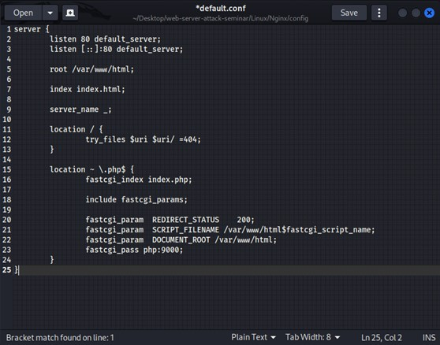

# web-server-attack-seminar writeup

## Apache Server
*Target:* Đọc được nội dung file /etc/passwd.

*Process:*
- Đề bài cho chúng ta một trang web giới thiệu về một công ty nào đó, web có các chức năng giới thiệu về công ty. 

- Trong quá trình recon, team đã sử dụng công cụ nmap để tìm hiểu về dịch vụ đang chạy trên web server này.  Sử dụng cờ `-sV` và ta có kết quả scan như sau:

- Osint trên google về các lỗi bảo mật của phiên bản **Apache 2.4.49** ta tìm được *CVE-2021-41773* về lỗi Path Traversal:

::

- Lỗi này xảy ra khi phiên bản này không kiểm tra được đầy đủ các kĩ thuật encoding url truyền vào. Cụ thể ở đây phiên bản này ko nhận ra dấu chấm thứ hai do đó không hiểu được `.%2/` là `../`.
- Dùng lệnh curl cùng với bypass `.%2/` để đọc file passwd (Ta có thể truy xuất trực tiếp file này nên dự đoán web này còn có lỗi miss config khi cho phép mọi user truy cập trực tiếp được đến các file trong directory của nó. Ví dụ như config Require all granted):

*Flag:*  F1301{Apache2_ư3b_s3rv3r_vuln_1337}

## Nginx Server
*Target:* RCE và lấy được nội dung file flag trong thư mục root.

*Process:*
- Truy cập vào trang web, ta sẽ thấy nơi để upload file. Team tiến hành kiểm tra các loại lỗi liên quan đến upload file.

- Vì team được đưa source code nên ta có thể xác định file type:

- Code không nói tới file `.php`, ta sẽ thử file có đuôi này và kết quả như sau:

- Team thử viết 1 đoạn mã php bất kì sau đó chuyển định dạng (đuôi file) thành .png/jpg...(các loại được phép) thì phát hiện hệ thống chỉ check theo tên file chứ ko validate theo nội dung &rarr; suy ra có thể thao túng được nội dung file. Idea là sẽ tìm các nào để hệ thống thực thi file dưới dạng code php.

&rarr; Upload file thành công. Nhưng khi truy cập vào đường dẫn tới file đó không hề có webshell được gửi lại.
- Xem file config:

- Ở đây các file kết thúc bằng .php sẽ chuyển cho fastcgi xử lý. Tại file php.ini mặc định tham số `cgi.fix_pathinfo=1`, khi nhận ra tệp abcd.php không tồn tại, nên tệp tin được xử lý sẽ là tệp tin trước tệp tin hiện tại - chính là file ảnh vừa được upload, được coi như một file php để thực thi, dẫn đến kết quả trả về nội dung của tệp ảnh.
- Ta thử truy cập đường dẫn tới file vừa upload và thêm `./php` vào sau cùng:

- Trang web hiện lỗi php.
- Kiểm tra gói tin có phương thức POST:

- Ta thấy đoạn code php mà ta đính vào file vừa mới upload lên.
- Thử với `phpinfo()` và bấm **Send**, sau đó **F5** trang web:

- Kiểm tra mục **disable_functions** và thấy web đã tắt nhiều lệnh dùng để thực thi như **exec**, **shell_exec**,... Mục đích kiểm tra là để xác định các hàm có thể hoặc không thể sử dụng để exploit.

- Thay vì cố gắng sử dụng mọi cách để lấy shell, ta sẽ sử dụng các hàm của php và dùng chúng thay cho các lệnh bên shell.
- Trước tiên ta cần biết directory có những cái gì &rarr; sử dụng scandir và đường dẫn là thư mục root ( / ).

- Sau khi bấm **Send** và **F5**, ta được:

- Phát hiện file flag trong thư mục này, tiến hành sử dụng readfile: 

- Kết quả:

*Flag:* F1301{Nginx_parsing_is_not_safe,right?}